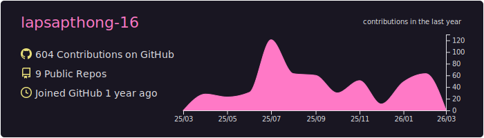
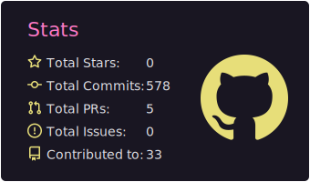
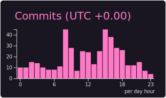
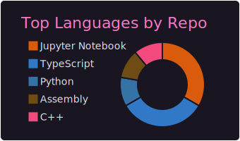
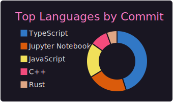

<!-- Hero -->
<h1 align="center">
  
</h1>

  <b>🧑‍💻 Currently Working As:</b> 🧑‍🎓 <b>Student</b> | 🚀 <b>Oasis Protocol Sentinel</b>

<!-- Social / quick info badges -->

  
  

<b>
3rd-year Data Science student building scalable backend systems and AI-driven solutions with an emphasis on performance and reliability.
</b>

---

## 👨‍💻 About Me

- 🤝 Backend-leaning engineer across **AI**, **blockchain**, and **automation**
- 🧠 Enjoys shaping **data & backend flows**, building **scalable services**, and **visualizing insights**
- 🏆 Hackathon-driven builder who prototypes fast, **measures**, and iterates
- 📚 Currently diving deeper into **AI systems**, **blockchain**, and **workflow automation**
- 🛠️ Comfortable with **Java/Node** backends + **TensorFlow** & **PyTorch**

---

## 🎨 Tech Stack & Tools

### 🧠 AI / Machine Learning

  

  
  

### ⚙️ Backend

  

  
  
  

### 🖥️ Frontend

  

### 🌐 Web3

  

  
  
  
  

---
## 📊 GitHub Stats

  

  
  

  
  

>

---

## 🐍 Contributions

  <picture>
    <source media="(prefers-color-scheme: dark)" srcset="https://raw.githubusercontent.com/lapsapthong-16/lapsapthong-16/output/github-contribution-grid-snake-dark.svg" />
    <source media="(prefers-color-scheme: light)" srcset="https://raw.githubusercontent.com/lapsapthong-16/lapsapthong-16/output/github-contribution-grid-snake.svg" />
    
  </picture>

<!-- Footer -->

  

