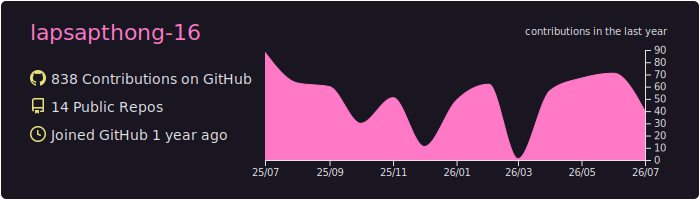
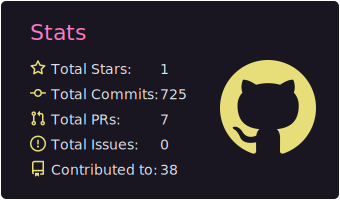
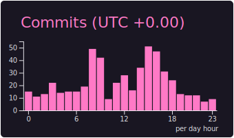
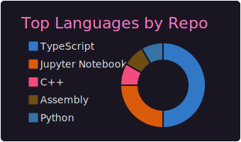
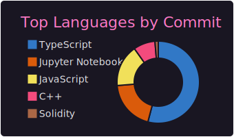

<!-- Header -->

<p align="center">
  
</p>

<!-- Hero -->

<h1 align="center">
  
</h1>

<p align="center">
  🤖 <b>Applied AI</b> • 🧠 <b>Data Science</b> • 📚 <b>RAG & Agents</b> • ⚙️ <b>Workflow Automation</b>
</p>

<!-- Social / quick info badges -->

<p align="center">
  <a href="https://www.linkedin.com/in/edwina-hon-548189340/" target="_blank" rel="noopener noreferrer">
    
  </a>
  <a href="mailto:honedwina@gmail.com">
    
  </a>
  
</p>

<p align="center">
  <b>
    I build applied AI systems that turn messy real-world data into structured, searchable, and automated workflows.
  </b>
</p>

---

## 🌷 About Me

* 🤖 AI-first builder focused on **RAG**, **AI agents**, **NLP**, **OCR automation**, and **model evaluation**
* 🧠 Data Science background with hands-on experience building AI workflows for real-world messy data
* 🧾 Interested in turning **documents, invoices, bank statements, reports, and unstructured text** into usable AI systems
* ⚙️ Comfortable connecting AI models with **APIs, databases, vector search, and workflow automation**
* 🏆 Hackathon-driven builder who likes fast prototypes, measurable outputs, and practical systems

<p align="center">
  
</p>

---

## 🧠 Current AI Direction

I’m building toward roles around:

<p align="center">
  
  
  
  
</p>

Currently exploring:

```txt
Agentic AI
RAG evaluation
MCP-style tool workflows
OCR automation
Vector databases
LLM-powered workflows
Human-in-the-loop AI
Smart factory / enterprise AI
```

Basically: I like AI that can actually do useful work inside a real workflow.

---

## 🏆 Hackathon Achievements

<p align="center">
  <i>Fast builds, shipped ideas, and a few fun builder moments along the way.</i>
</p>

<table>
  <tr>
    <th>Event</th>
    <th>Achievement</th>
    <th>Project & Description</th>
    <th>Links</th>
  </tr>

  <tr>
    <td><b>Monad Hackathon 2026</b></td>
    <td>🥈 2nd Place</td>
    <td>
      <b>Brain Hotel</b> — An AI knowledge-preservation platform that turns expert knowledge, documents, and experiences into searchable memory vaults through RAG and interactive memory rooms.
      <br/><br/>
      
      
      
      
    </td>
    <td><a href="https://github.com/lapsapthong-16/monad2026/blob/main/README.md">Repo</a></td>
  </tr>

  <tr>
    <td><b>Touch ’n Go FinHack 2026</b></td>
    <td>🏅 4th Place</td>
    <td>
      <b>Signal</b> — A real-time AI recommendation system for TnG eWallet that delivers context-aware deals during and after transactions using semantic enrichment and ML ranking.
      <br/><br/>
      
      
      
      
    </td>
    <td><a href="https://github.com/lapsapthong-16/roadblock">Repo</a></td>
  </tr>

  <tr>
    <td><b>Deriv AI Hackathon 2026</b></td>
    <td>🥈 2nd Place</td>
    <td>
      <b>Truman</b> — A multi-agent AI decision-support system that transforms unstructured enterprise data into structured events, predictions, and actionable recommendations.
      <br/><br/>
      
      
      
      
    </td>
    <td><a href="https://github.com/lapsapthong-16/deriv2026">Repo</a></td>
  </tr>

  <tr>
    <td><b>ETH HackMoney 2026</b></td>
    <td>🏅 ENS Prize Pool Award</td>
    <td>
      <b>Xiphias</b> — A privacy-focused prediction market protocol that reduces liquidity fragmentation, whale manipulation, and wallet-level trade exposure using unified time-based markets, hybrid AMM + CLOB execution, and shielded trading.
      <br/><br/>
      
      
      
      
    </td>
    <td><a href="https://github.com/lapsapthong-16/hackmoney26">Repo</a></td>
  </tr>

  <tr>
    <td><b>ETH Tokyo 2025</b></td>
    <td>🏆 AI Track Champion</td>
    <td>
      <b>Toku Kaigan</b> — A privacy-first AI assistant using Trusted Execution Environments for secure LLM inference, multi-model orchestration, and optional RAG pipelines.
      <br/><br/>
      
      
      
      
    </td>
    <td><a href="https://github.com/lapsapthong-16/ethtokyo">Repo</a></td>
  </tr>

  <tr>
    <td><b>IOTA Malaysia Hackathon 2025</b></td>
    <td>🎯 6th Place</td>
    <td>
      <b>Cap Attendance</b> — A decentralized proof-of-attendance system that verifies student attendance using face recognition, maps face hashes to on-chain DIDs, and issues verifiable academic credentials through smart contracts.
      <br/><br/>
      
      
      
      
    </td>
    <td><a href="https://github.com/lapsapthong-16/iota-hackathon">Repo</a></td>
  </tr>

  <tr>
    <td><b>EasyA x Ripple Hackathon Singapore</b></td>
    <td>🥈 2nd Place</td>
    <td>
      <b>RipplexEasyA</b> — A decentralized payment infrastructure for crypto-to-fiat payments using just-in-time card funding, virtual debit cards, and transaction orchestration across XRPL and EVM-based assets.
      <br/><br/>
      
      
      
      
    </td>
    <td><a href="https://github.com/lapsapthong-16/EasyA-Wiser">Repo</a></td>
  </tr>

  <tr>
    <td><b>ETHGlobal Taipei 2025</b></td>
    <td>🥈 1inch Track 2nd Place</td>
    <td>
      <b>MCP</b> — A cross-system automation platform connecting Web2 tools like Gmail and Google Sheets with Web3 services like MetaMask and 1inch through event-driven workflows.
      <br/><br/>
      
      
      
      
    </td>
    <td><a href="https://github.com/lapsapthong-16/memest-cutest-platform">Repo</a></td>
  </tr>

  <tr>  
    <td><b>Eigen Games / ETH Denver 2025</b></td>
      <td>🥉 Hyperbolic Track 3rd Place</td>
      <td>
        <b>Hyperbolic GPU Training Platform</b> — A machine learning training workflow where users upload a CSV, select a model, and run training jobs on rented Hyperbolic GPUs instead of relying on local compute.
      <br/><br/>  
        
       
        
        
    </td>  
    <td><a href="#https://github.com/lapsapthong-16/Hyperbolic-AgentKit">Repo</a></td>  
  </tr>
  
</table>

---

## 🧩 Builder Side Quests

<p align="center">
  <i>Research, personal projects, experiments, and systems I build outside the usual hackathon format.</i>
</p>

<table>
  <tr>
    <th>Project</th>
    <th>Type</th>
    <th>Description</th>
    <th>Links</th>
  </tr>
  <tr>
    <td><b>🔎 Browhere</b></td>
    <td>Personal Project</td>
    <td>
      A semantic desktop search idea for finding files through meaning instead of exact filenames.
      Designed around embeddings, local file understanding, and AI-assisted discovery across personal knowledge.
      <br/><br/>
      
      
      
      
    </td>
    <td><a href="https://github.com/lapsapthong-16/browhere">Repo</a></td>
  </tr>
  
  <tr>
    <td><b>💬 Sentiment + Emotion Classifier</b></td>
    <td>Final Year Project</td>
    <td>
      Built a multitask learning framework for joint sentiment and emotion classification on Reddit crisis communication text.
      Fine-tuned BERTweet and DistilRoBERTa under single-task and multi-task settings, then evaluated robustness using Macro-F1 across multiple runs.
      <br/><br/>
      
      
      
      
    </td>
    <td><a href="https://github.com/lapsapthong-16/monkiebot">Repo</a></td>
  </tr>
  
  <tr>
    <td><b>📄 RAG Document QA Research</b></td>
    <td>Published Research</td>
    <td>
      Co-authored a document interaction system using RAG, FAISS vector search, embedding models, and LLMs.
      Evaluated outputs using ROUGE-1, BERTScore, Human-Like Performance, and latency to study response quality and real-time usability.
      <br/><br/>
      
      
      
      
    </td>
    <td><a href="https://github.com/lapsapthong-16/monkiebot">Repo</a></td>
  </tr>
  
</table>

---

## 🎨 Tech Stack & Tools

### 🤖 AI / Machine Learning / NLP

<p align="center">
  
</p>

<p align="center">
  
  
  
  
</p>

### 📚 RAG / Agents / Vector Search

<p align="center">
  
  
  
  
  
  
</p>

### ⚙️ Backend / APIs / Workflow Automation

<p align="center">
  
</p>

<p align="center">
  
  
  
  
</p>

### 🖥️ Frontend / Product Prototyping

<p align="center">
  
</p>

### ⛓️ Bonus Domain: Web3

<p align="center">
  
</p>

<p align="center">
  
  
  
  
</p>

<p align="center">
  <i>Web3 is my bonus playground — especially where it overlaps with AI, automation, privacy, and secure workflows.</i>
</p>

---

## ✨ Selected Highlights

### 🧾 AI Software Engineer Intern

* Built AI-powered automation for financial workflows
* Worked on OCR benchmarking, bank statement extraction, invoice matching, and entity matching
* Integrated AI modules into workflows using **FastAPI**, databases, and workflow orchestration tools
* Designed human-in-the-loop approval flows for more reliable AI-assisted decisions

### 📄 Published RAG Research

* Co-authored research on document interaction using **RAG**, **FAISS**, embedding models, and LLMs
* Evaluated responses using **ROUGE-1**, **BERTScore**, and **Human-Like Performance**
* Focused on making document QA more accurate, efficient, and human-aligned

### 🧠 NLP / Final Year Project

* Built a multitask learning framework for **sentiment + emotion classification** on Reddit crisis text
* Fine-tuned transformer models including **BERTweet** and **DistilRoBERTa**
* Evaluated model robustness using **Macro-F1** across multiple training runs

### 🏆 Hackathon Highlights

* 🥈 **Deriv AI Hackathon 2026** — Multi-agent AI system for enterprise data
* 🏅 **Touch ’n Go FinHack 2026** — AI-powered real-time recommendation system
* 🥈 **ETHGlobal Taipei** — Cross-system AI automation platform for Web2 + Web3 workflows
* 🏆 **ETH Tokyo 2025** — Privacy-first AI assistant using TEE and LLM orchestration

---

## 🧪 AI Things I Like Thinking About

<p align="center">
  
  
  
  
</p>

---

## 📊 GitHub Stats

<p align="center">
  
</p>

<p align="center">
  
  
</p>

<p align="center">
  
  
</p>

---

## 🐍 Contributions

<div align="center">
  <picture>
    <source media="(prefers-color-scheme: dark)" srcset="https://raw.githubusercontent.com/lapsapthong-16/lapsapthong-16/output/github-contribution-grid-snake-dark.svg" />
    <source media="(prefers-color-scheme: light)" srcset="https://raw.githubusercontent.com/lapsapthong-16/lapsapthong-16/output/github-contribution-grid-snake.svg" />
    
  </picture>
</div>

---

<p align="center">
  <b>Building AI systems that are practical, measurable, and useful beyond the demo.</b>
</p>

<!-- Footer -->

<p align="center">
  
</p>
